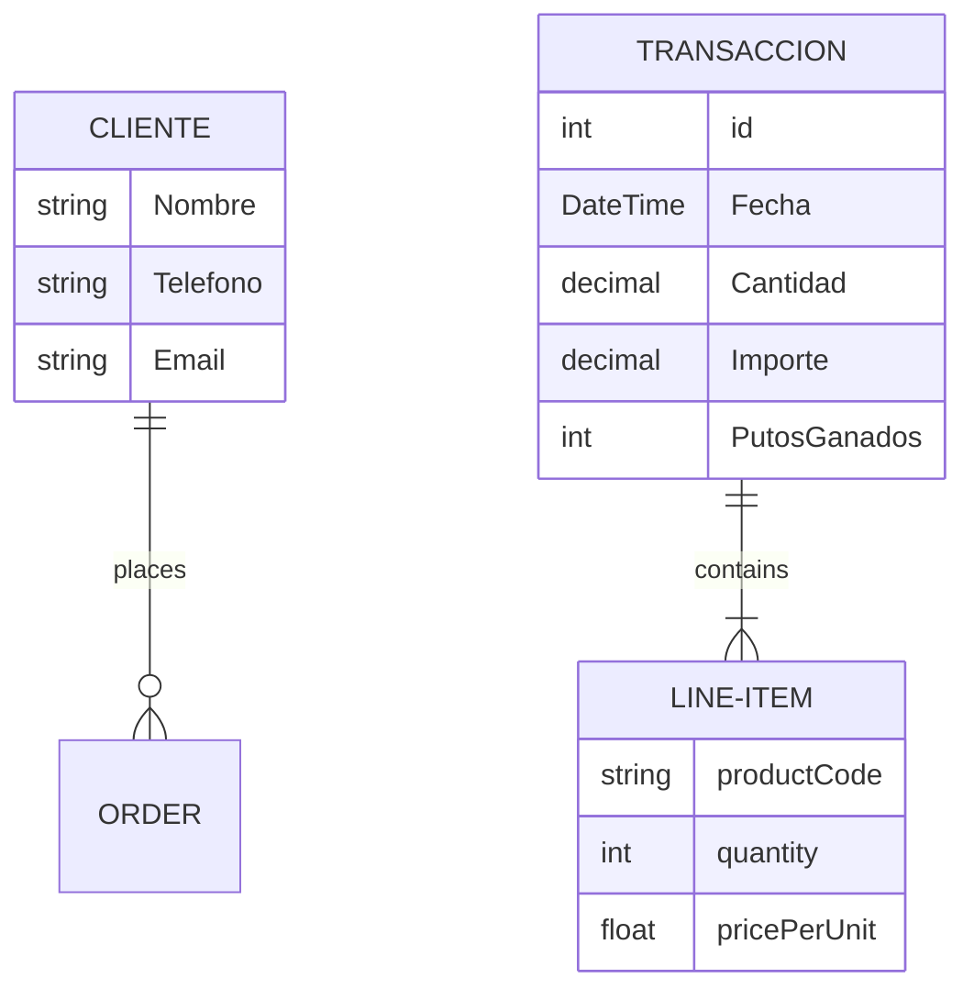

```mermaid
erDiagram
    CLIENTE ||--o{ ORDER : places
    CLIENTE {
        string Nombre
        string Telefono
        string Email
    }
    TRANSACCION ||--|{ LINE-ITEM : contains
    TRANSACCION {
        int id
        DateTime Fecha
        decimal Cantidad
        decimal Importe
        int PutosGanados
    }
    LINE-ITEM {
        string productCode
        int quantity
        float pricePerUnit
    }

```